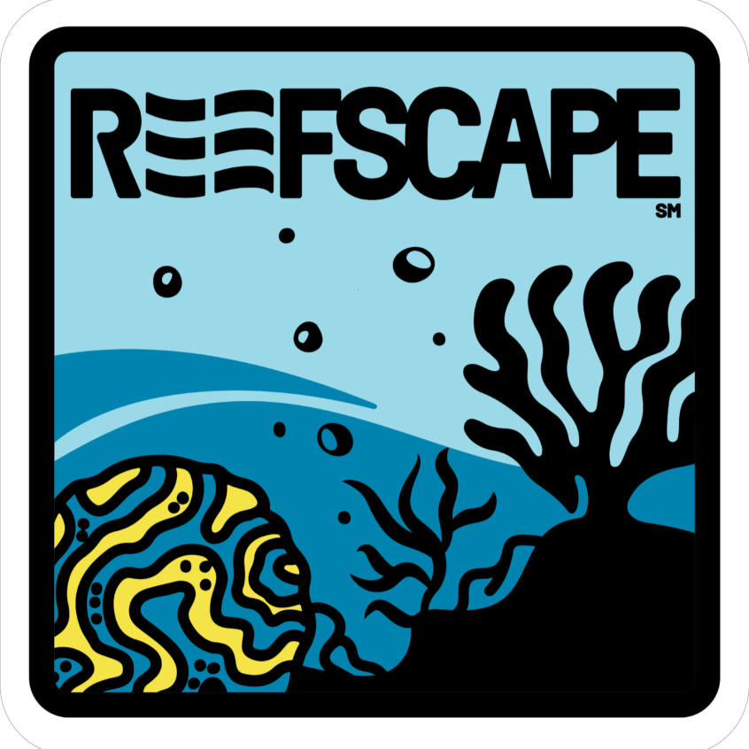

## About Me

Hi! I’m a 10th-grade student at TÜBİTAK Science High School ([TÜBİTAK Fen Lisesi](https://tubitakfenlisesi.meb.k12.tr/tema/index.php)). I’m interested in programming, robotics, mechanics, and electronics, and I love making projects and applications in these fields.

Over the years, I’ve been actively involved in robotics competitions like [FRC](projects\2025\frc) and [Teknofest](projects\2025\uuv), where I’ve led teams and contributed as the programming lead. My experience mainly includes robotic programming, CAD (mainly [Onshape](https://www.onshape.com/en/) and [SolidWorks](https://www.solidworks.com/)), foundation of mechanics and electronics, lead. These experiences have taught me valuable skills in teamwork, leadership, and technical problem-solving.

In the future, I aspire to study computer science and engineering at a leading university, where I can continue to making robots and developing new applications to be helpful to humanity. Outside of academics, I enjoy gaming, exploring new technologies, working on personal programming, robotics and teaching new things to other people.

## Certificates and Awards
AWS Miuul Bootcamp ([link](certificates\aws_certificate.png))
